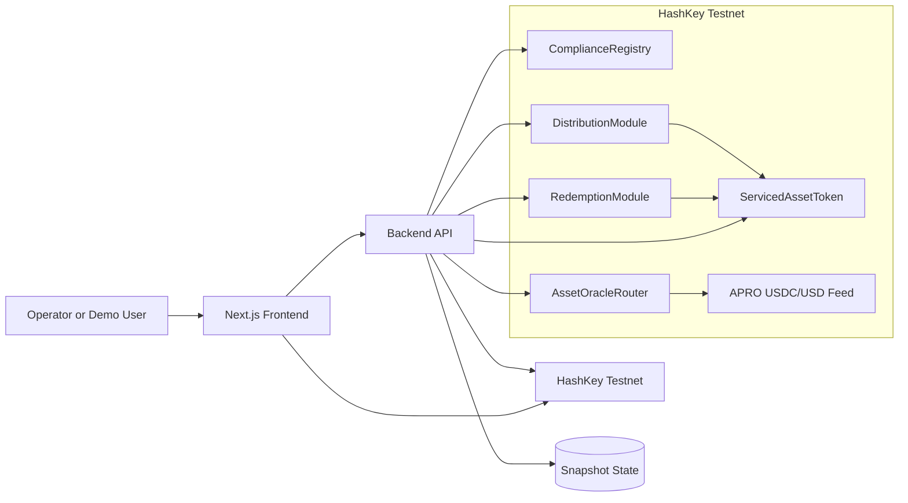
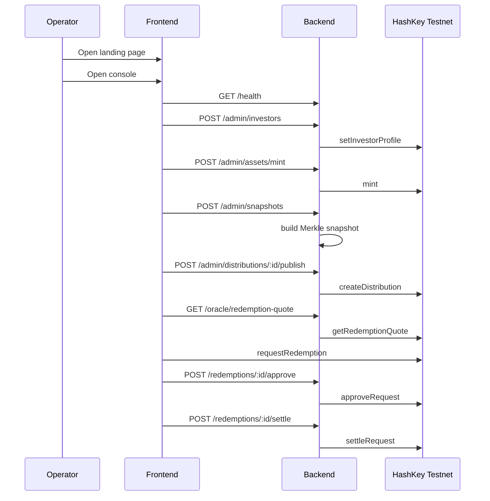

# AssetFlow Architecture

AssetFlow is split into three product layers:

- on-chain servicing contracts
- a backend orchestration layer for snapshots and operator actions
- a Next.js frontend with a branded landing page and a guided console

## System Diagram

## Contract Responsibilities

### `ComplianceRegistry`

- stores investor approval status
- enforces jurisdiction, tier, accreditation, freeze, and expiry rules
- exposes an exempt counterparty path for servicing modules
- can later be extended with external eligibility or KYC adapters

### `ServicedAssetToken`

- restricted ERC-20 representing the serviced fund or security unit
- checks transfer eligibility through `ComplianceRegistry`
- supports issuer minting
- supports servicing-only burn and servicing transfer flows

### `DistributionModule`

- receives payout funding
- records a Merkle root for one payout window
- lets holders claim their payout using proofs
- supports cancellation and refund of unclaimed balances

### `RedemptionModule`

- queues holder redemption requests
- supports issuer approve, reject, settle
- burns serviced units on settlement
- returns units safely on reject or cancel, even if the investor becomes ineligible later

### `AssetOracleRouter`

- reads configured oracle feeds
- returns quote data for redemption valuation
- does not hard-enforce settlement pricing on-chain in the current demo

## Backend Responsibilities

The backend is intentionally thin. It is not a second protocol layer.

It handles:

- admin writes for investor profiles and jurisdiction policy
- snapshot construction and Merkle proof generation
- publication of distributions and local tracking of snapshot-to-distribution mapping
- claim intent generation
- oracle quote reads
- redemption read, approve, reject, settle actions

It does not:

- custody user assets
- recalculate claim state after on-chain settlement
- replace on-chain permissions

## Frontend Responsibilities

The frontend has two routes:

- `/`
  Purpose: explain the product clearly and position it for demo or judging
- `/console`
  Purpose: guide an operator through setup, payout preparation, holder service, and redemption handling

The console is designed to be understandable by non-technical viewers:

- Step 1: approve who can hold the asset
- Step 2: issue units
- Step 3: prepare a payout window
- Step 4: publish and service holders

## Demo Flow

## Current Deployment

- ComplianceRegistry: `0xC6234816f981C0bC8E8FB48Ba6FF9fb864212f3c`
- ServicedAssetToken: `0x4372222b90612bCD37e09452052DE5b44DfBC10C`
- DistributionModule: `0xE6ab32D718AFe5932c7805c231AD35A6133Aa383`
- RedemptionModule: `0x367a53A6728771E66f9e430932D7FA75B446fA0a`
- OracleRouter: `0xD22602E3114b754a86583ce2d48Cce05d2becd78`

## Open Product Edges

- automated seeding script for demo state
- richer console summaries once live snapshot data exists
- optional explorer/source verification workflow
- optional HSP adapter if PayFi positioning becomes important
