# AssetFlow architecture

How AssetFlow is built: the Solana program and the programs it relies on, its accounts, each servicing flow, private
holdings on MagicBlock, the circuit breaker for trading pools, the EVM contracts, and the app. Every diagram is drawn
from the code in this repository. [README.md](README.md) says what the product does;
[evm/SECURITY.md](evm/SECURITY.md) covers the EVM contracts' guarantees and static analysis; the first version's
architecture (HashKey Chain, April 2026) is kept in [contracts/ARCHITECTURE.md](contracts/ARCHITECTURE.md).

1. [The system at a glance](#1-the-system-at-a-glance)
2. [Repository layout](#2-repository-layout)
3. [The Solana program](#3-the-solana-program)
4. [Accounts and addresses](#4-accounts-and-addresses)
5. [Eligibility: the gate behind Token ACL](#5-eligibility-the-gate-behind-token-acl)
6. [KYC once, on the Solana Attestation Service](#6-kyc-once-on-the-solana-attestation-service)
7. [Coupons: a register counted on-chain](#7-coupons-a-register-counted-on-chain)
8. [Early redemptions](#8-early-redemptions)
9. [Maturity](#9-maturity)
10. [Private holdings on MagicBlock](#10-private-holdings-on-magicblock)
11. [The circuit breaker for trading pools](#11-the-circuit-breaker-for-trading-pools)
12. [The EVM contracts](#12-the-evm-contracts)
13. [The app](#13-the-app)
14. [Deployments](#14-deployments)
15. [Who can do what](#15-who-can-do-what)
16. [What you trust](#16-what-you-trust)

## 1. The system at a glance

AssetFlow services a tokenized bond after it is issued: who may hold it, what each holder is owed on a record date,
redemptions and maturity. On Solana it is one Anchor program that acts as the gate of a Token-2022 mint through Token
ACL. The same servicing runs as Solidity contracts on EVM chains, with the Ethereum Attestation Service for KYC once.
One Next.js app drives both.

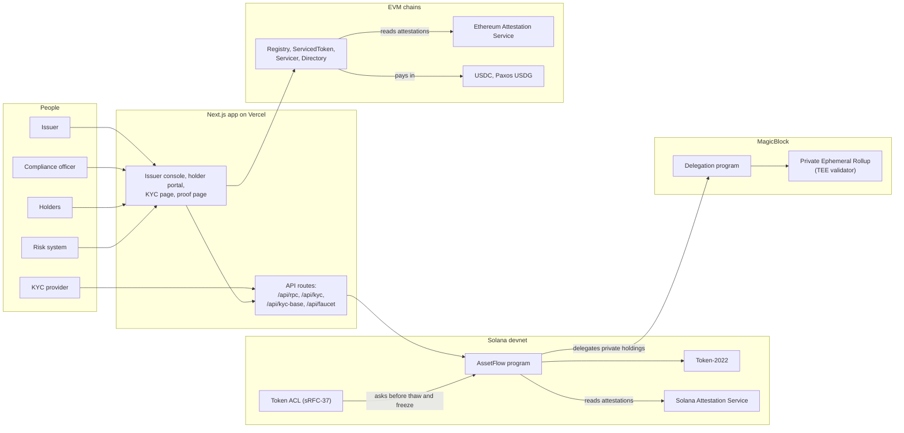
```mermaid
flowchart LR
  subgraph People
    I["Issuer"]
    C["Compliance officer"]
    H["Holders"]
    K["KYC provider"]
    R["Risk system"]
  end

  subgraph App["Next.js app on Vercel"]
    UI["Issuer console, holder portal,<br/>KYC page, proof page"]
    API["API routes:<br/>/api/rpc, /api/kyc,<br/>/api/kyc-base, /api/faucet"]
  end

  subgraph Solana["Solana devnet"]
    AF["AssetFlow program"]
    ACL["Token ACL (sRFC-37)"]
    T22["Token-2022"]
    SAS["Solana Attestation Service"]
  end

  subgraph MB["MagicBlock"]
    DLG["Delegation program"]
    PER["Private Ephemeral Rollup<br/>(TEE validator)"]
  end

  subgraph EVM["EVM chains"]
    CON["Registry, ServicedToken,<br/>Servicer, Directory"]
    EAS["Ethereum Attestation Service"]
    USD["USDC, Paxos USDG"]
  end

  I & C & H & R --> UI
  K --> API
  UI --> API
  API --> AF
  UI --> CON
  ACL -->|asks before thaw and freeze| AF
  AF --> T22
  AF -->|reads attestations| SAS
  AF -->|delegates private holdings| DLG
  DLG --> PER
  CON -->|reads attestations| EAS
  CON -->|pays in| USD
```

## 2. Repository layout

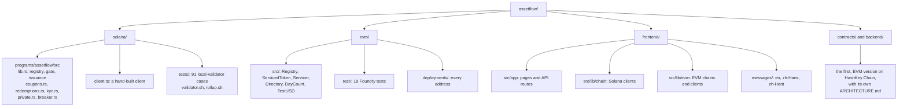
```mermaid
flowchart TD
  Root["assetflow/"] --> S["solana/"]
  Root --> E["evm/"]
  Root --> F["frontend/"]
  Root --> CT["contracts/ and backend/"]

  S --> S1["programs/assetflow/src<br/>lib.rs: registry, gate, issuance<br/>coupons.rs, redemptions.rs, kyc.rs,<br/>private.rs, breaker.rs"]
  S --> S2["client.ts: a hand-built client"]
  S --> S3["tests/: 91 local-validator cases<br/>validator.sh, rollup.sh"]

  E --> E1["src/: Registry, ServicedToken, Servicer,<br/>Directory, DayCount, TestUSD"]
  E --> E2["test/: 19 Foundry tests"]
  E --> E3["deployments/: every address"]

  F --> F1["src/app: pages and API routes"]
  F --> F2["src/lib/chain: Solana clients"]
  F --> F3["src/lib/evm: EVM chains and clients"]
  F --> F4["messages/: en, zh-Hans, zh-Hant"]

  CT --> CT1["the first, EVM version on HashKey Chain,<br/>with its own ARCHITECTURE.md"]
```

## 3. The Solana program

One program, `BWDCF6dLYETPYquDGKm8X6pyLnMZGhisporuTbozjtwR`, in six modules. `lib.rs` holds the registry, asset
registration, issuance, compliance freezes and the two questions Token ACL asks a gate. Each other module adds one
servicing concern.

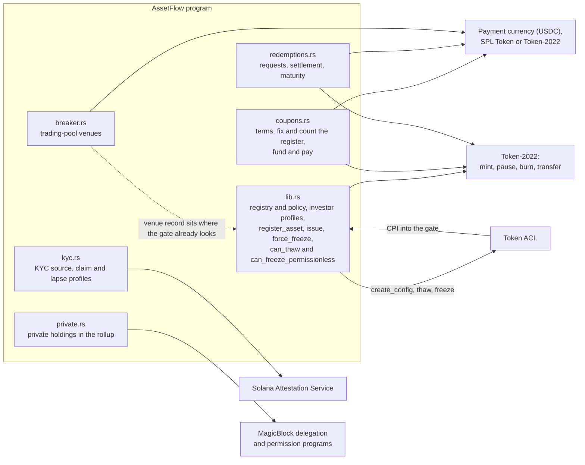
```mermaid
flowchart LR
  subgraph AssetFlow["AssetFlow program"]
    L["lib.rs<br/>registry and policy, investor profiles,<br/>register_asset, issue, force_freeze,<br/>can_thaw and can_freeze_permissionless"]
    CO["coupons.rs<br/>terms, fix and count the register,<br/>fund and pay"]
    RE["redemptions.rs<br/>requests, settlement, maturity"]
    KY["kyc.rs<br/>KYC source, claim and lapse profiles"]
    PR["private.rs<br/>private holdings in the rollup"]
    BR["breaker.rs<br/>trading-pool venues"]
  end

  ACL["Token ACL"] -->|CPI into the gate| L
  L -->|create_config, thaw, freeze| ACL
  L & CO & RE --> T22["Token-2022:<br/>mint, pause, burn, transfer"]
  KY --> SAS["Solana Attestation Service"]
  PR --> DLG["MagicBlock delegation<br/>and permission programs"]
  CO & RE & BR --> CUR["Payment currency (USDC),<br/>SPL Token or Token-2022"]
  BR -.->|venue record sits where the gate already looks| L
```

Every authority over the mint belongs to the asset account, a PDA of the program, so no personal key can mint, freeze,
pause or move units around the program.

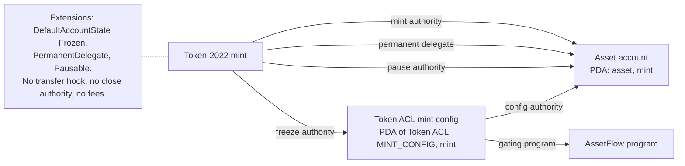
```mermaid
flowchart LR
  M["Token-2022 mint"]
  X["Extensions: DefaultAccountState Frozen,<br/>PermanentDelegate, Pausable.<br/>No transfer hook, no close authority, no fees."]
  A["Asset account<br/>PDA: asset, mint"]
  MC["Token ACL mint config<br/>PDA of Token ACL: MINT_CONFIG, mint"]
  G["AssetFlow program"]
  M -->|mint authority| A
  M -->|permanent delegate| A
  M -->|pause authority| A
  M -->|freeze authority| MC
  MC -->|config authority| A
  MC -->|gating program| G
  X -.- M
```

## 4. Accounts and addresses

Every program account is a PDA of the AssetFlow program. Seeds are listed as the program derives them.

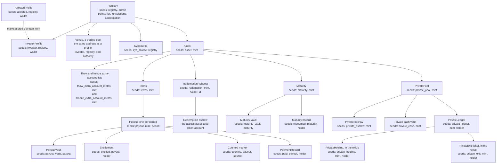
```mermaid
flowchart TD
  REG["Registry<br/>seeds: registry, admin<br/>policy: tier, jurisdictions, accreditation"]
  INV["InvestorProfile<br/>seeds: investor, registry, wallet"]
  VEN["Venue, a trading pool<br/>the same address as a profile:<br/>investor, registry, pool authority"]
  KS["KycSource<br/>seeds: kyc_source, registry"]
  ATT["AttestedProfile<br/>seeds: attested, registry, wallet"]
  AS["Asset<br/>seeds: asset, mint"]
  TL["Thaw and freeze extra-account lists<br/>seeds: thaw_extra_account_metas, mint<br/>and freeze_extra_account_metas, mint"]
  TM["Terms<br/>seeds: terms, mint"]
  PO["Payout, one per period<br/>seeds: payout, mint, period"]
  PV["Payout vault<br/>seeds: payout_vault, payout"]
  EN["Entitlement<br/>seeds: entitled, payout, holder"]
  CS["Counted marker<br/>seeds: counted, payout, source"]
  PM["PaymentRecord<br/>seeds: paid, payout, holder"]
  RQ["RedemptionRequest<br/>seeds: redemption, mint, holder, id"]
  ES["Redemption escrow<br/>the asset's associated token account"]
  MA["Maturity<br/>seeds: maturity, mint"]
  MV["Maturity vault<br/>seeds: maturity_vault, maturity"]
  MR["MaturityRecord<br/>seeds: redeemed, maturity, holder"]
  PP["PrivatePool<br/>seeds: private_pool, mint"]
  PE["Private escrow<br/>seeds: private_escrow, mint"]
  PC["Private cash vault<br/>seeds: private_cash, mint"]
  PL["PrivateLedger<br/>seeds: private_ledger, mint, holder"]
  PH["PrivateHolding, in the rollup<br/>seeds: private_holding, mint, holder"]
  PX["PrivateExit ticket, in the rollup<br/>seeds: private_exit, mint, holder"]

  REG --> INV
  REG --> VEN
  REG --> KS
  ATT -.->|marks a profile written from| INV
  REG --> AS
  AS --> TL
  AS --> TM
  TM --> PO
  PO --> PV
  PO --> EN
  PO --> CS
  PO --> PM
  AS --> RQ
  RQ --> ES
  AS --> MA
  MA --> MV
  MA --> MR
  AS --> PP
  PP --> PE
  PP --> PC
  PP --> PL
  PL --> PH
  PL --> PX
```

## 5. Eligibility: the gate behind Token ACL

Holder accounts start frozen. A plain Token-2022 transfer never calls AssetFlow, so every wallet and program that
handles Token-2022 handles the asset. Eligibility is decided when an account is thawed or frozen: Token ACL holds the
mint's freeze authority and asks the gate before every permissionless thaw or freeze.

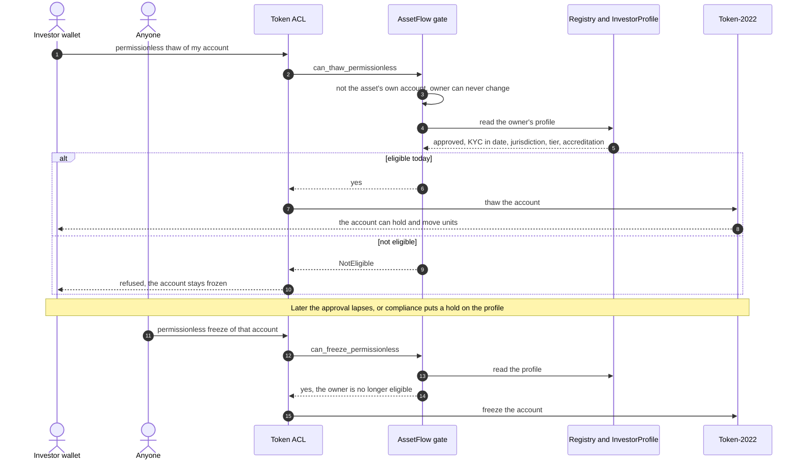
```mermaid
sequenceDiagram
  autonumber
  actor W as Investor wallet
  actor X as Anyone
  participant ACL as Token ACL
  participant G as AssetFlow gate
  participant P as Registry and InvestorProfile
  participant T as Token-2022

  W->>ACL: permissionless thaw of my account
  ACL->>G: can_thaw_permissionless
  G->>G: not the asset's own account, owner can never change
  G->>P: read the owner's profile
  P-->>G: approved, KYC in date, jurisdiction, tier, accreditation
  alt eligible today
    G-->>ACL: yes
    ACL->>T: thaw the account
    T-->>W: the account can hold and move units
  else not eligible
    G-->>ACL: NotEligible
    ACL-->>W: refused, the account stays frozen
  end

  Note over W,T: Later the approval lapses, or compliance puts a hold on the profile
  X->>ACL: permissionless freeze of that account
  ACL->>G: can_freeze_permissionless
  G->>P: read the profile
  G-->>ACL: yes, the owner is no longer eligible
  ACL->>T: freeze the account
```

Token ACL hands the gate five accounts and the list itself. The gate's other accounts are resolved from that list,
which the program writes at registration, so a client never chooses them.

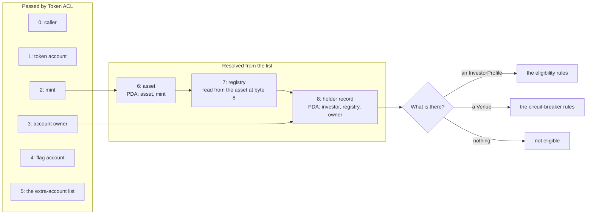
```mermaid
flowchart LR
  subgraph Passed["Passed by Token ACL"]
    A0["0: caller"]
    A1["1: token account"]
    A2["2: mint"]
    A3["3: account owner"]
    A4["4: flag account"]
    A5["5: the extra-account list"]
  end
  subgraph Resolved["Resolved from the list"]
    A6["6: asset<br/>PDA: asset, mint"]
    A7["7: registry<br/>read from the asset at byte 8"]
    A8["8: holder record<br/>PDA: investor, registry, owner"]
  end
  A2 --> A6
  A6 --> A7
  A7 --> A8
  A3 --> A8
  A8 --> D{"What is there?"}
  D -->|an InvestorProfile| E["the eligibility rules"]
  D -->|a Venue| V["the circuit-breaker rules"]
  D -->|nothing| N["not eligible"]
```

## 6. KYC once, on the Solana Attestation Service

A registry can trust one KYC provider's credential and schema. An investor verified once by that provider onboards into
every registry that trusts it, with nothing from the issuer. The attestation stays the source: once it is gone, anyone
can withdraw the approval.

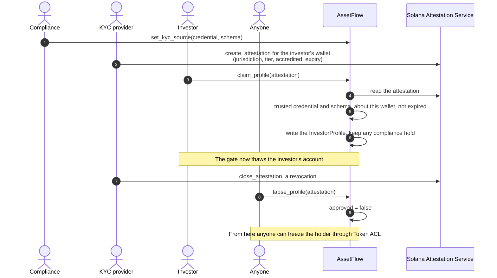
```mermaid
sequenceDiagram
  autonumber
  actor C as Compliance
  actor K as KYC provider
  actor W as Investor
  actor X as Anyone
  participant AF as AssetFlow
  participant SAS as Solana Attestation Service

  C->>AF: set_kyc_source(credential, schema)
  K->>SAS: create_attestation for the investor's wallet<br/>(jurisdiction, tier, accredited, expiry)
  W->>AF: claim_profile(attestation)
  AF->>SAS: read the attestation
  AF->>AF: trusted credential and schema, about this wallet, not expired
  AF->>AF: write the InvestorProfile, keep any compliance hold
  Note over W,AF: The gate now thaws the investor's account

  K->>SAS: close_attestation, a revocation
  X->>AF: lapse_profile(attestation)
  AF->>AF: approved = false
  Note over X,AF: From here anyone can freeze the holder through Token ACL
```

## 7. Coupons: a register counted on-chain

The terms live on-chain and the program computes every amount: 30/360, rounded down to the cent on each holder's whole
holding. Nobody hands the program a list of holders. On the record date the mint pauses, and anyone counts every source
into the register until the count reaches the supply. A payout's status on-chain is `Counting` then `Counted`; funded
and paid follow from its vault and its payment records.

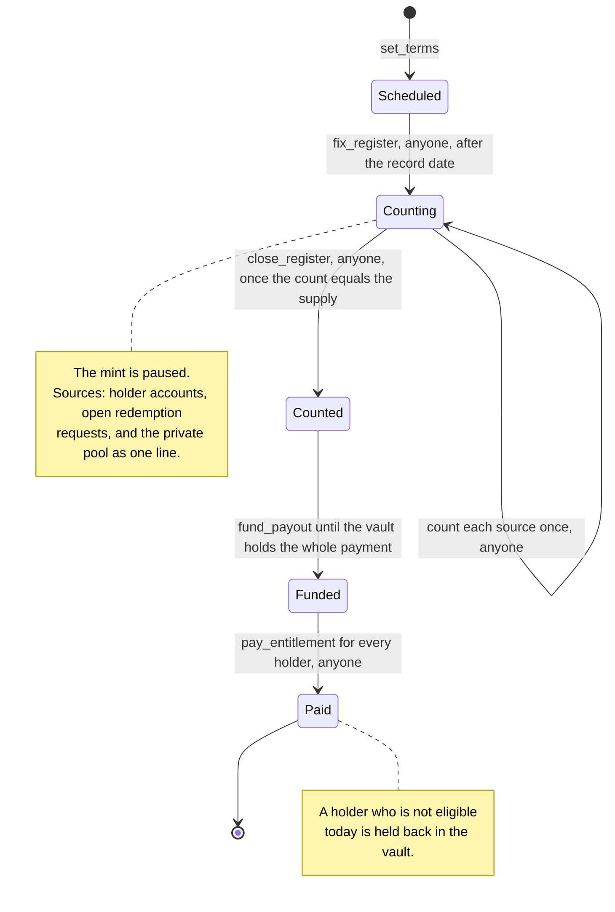
```mermaid
stateDiagram-v2
  [*] --> Scheduled: set_terms
  Scheduled --> Counting: fix_register, anyone, after the record date
  Counting --> Counting: count each source once, anyone
  Counting --> Counted: close_register, anyone, once the count equals the supply
  Counted --> Funded: fund_payout until the vault holds the whole payment
  Funded --> Paid: pay_entitlement for every holder, anyone
  Paid --> [*]
  note right of Counting
    The mint is paused.
    Sources: holder accounts, open redemption
    requests, and the private pool as one line.
  end note
  note right of Paid
    A holder who is not eligible
    today is held back in the vault.
  end note
```

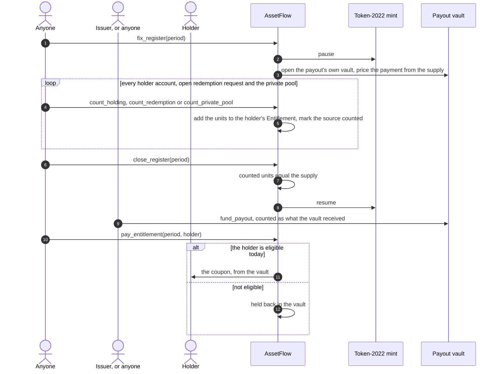
```mermaid
sequenceDiagram
  autonumber
  actor X as Anyone
  actor I as Issuer, or anyone
  actor H as Holder
  participant AF as AssetFlow
  participant T as Token-2022 mint
  participant V as Payout vault

  X->>AF: fix_register(period)
  AF->>T: pause
  AF->>V: open the payout's own vault, price the payment from the supply
  loop every holder account, open redemption request and the private pool
    X->>AF: count_holding, count_redemption or count_private_pool
    AF->>AF: add the units to the holder's Entitlement, mark the source counted
  end
  X->>AF: close_register(period)
  AF->>AF: counted units equal the supply
  AF->>T: resume
  I->>V: fund_payout, counted as what the vault received
  X->>AF: pay_entitlement(period, holder)
  alt the holder is eligible today
    AF->>H: the coupon, from the vault
  else not eligible
    AF->>AF: held back in the vault
  end
```

## 8. Early redemptions

A holder asks to redeem early. The units wait in an escrow the asset account owns, and the program prices settlement at
face plus interest accrued from the start of the running period, with none once that period's record date has passed.

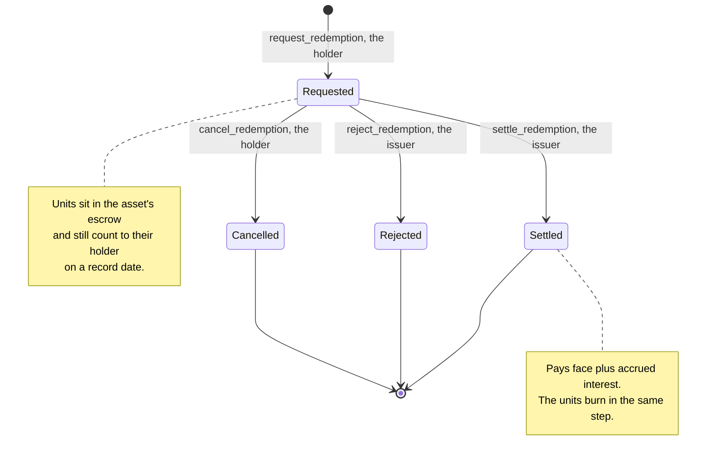
```mermaid
stateDiagram-v2
  [*] --> Requested: request_redemption, the holder
  Requested --> Settled: settle_redemption, the issuer
  Requested --> Rejected: reject_redemption, the issuer
  Requested --> Cancelled: cancel_redemption, the holder
  Settled --> [*]
  Rejected --> [*]
  Cancelled --> [*]
  note right of Requested
    Units sit in the asset's escrow
    and still count to their holder
    on a record date.
  end note
  note right of Settled
    Pays face plus accrued interest.
    The units burn in the same step.
  end note
```

## 9. Maturity

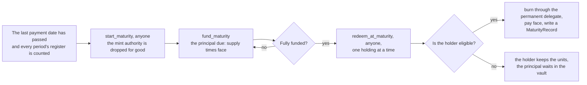
```mermaid
flowchart LR
  A["The last payment date has passed<br/>and every period's register is counted"] --> B["start_maturity, anyone<br/>the mint authority is dropped for good"]
  B --> C["fund_maturity<br/>the principal due: supply times face"]
  C --> D{"Fully funded?"}
  D -->|no| C
  D -->|yes| E["redeem_at_maturity, anyone,<br/>one holding at a time"]
  E --> F{"Is the holder eligible?"}
  F -->|yes| G["burn through the permanent delegate,<br/>pay face, write a MaturityRecord"]
  F -->|no| H["the holder keeps the units,<br/>the principal waits in the vault"]
```

## 10. Private holdings on MagicBlock

An issuer can let holders keep units out of public view. A holder's units sit in an escrow on Solana, and their share
lives in an AssetFlow account delegated to MagicBlock's Private Ephemeral Rollup, a validator in an Intel TDX enclave.
The program accepts no other validator, and MagicBlock's permission program sets who may read each holding.

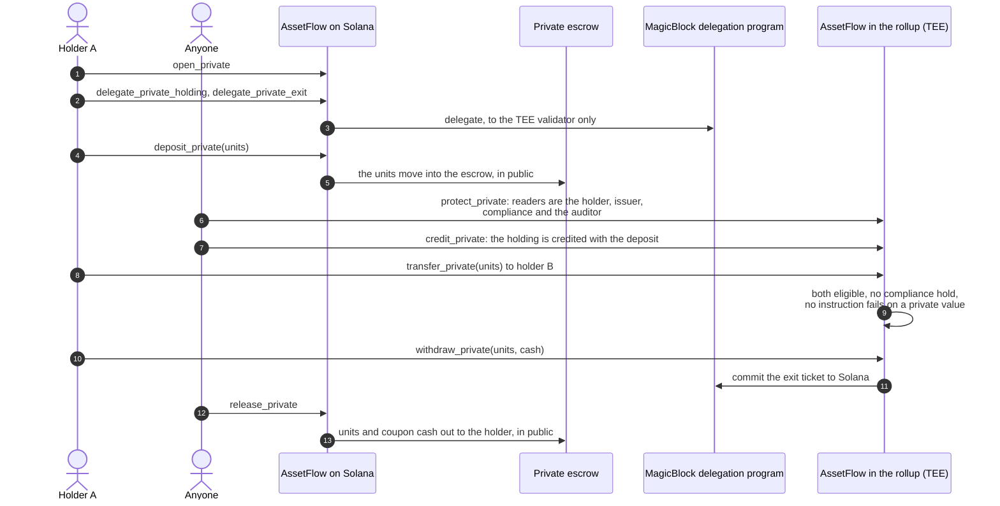
```mermaid
sequenceDiagram
  autonumber
  actor H as Holder A
  actor X as Anyone
  participant S as AssetFlow on Solana
  participant E as Private escrow
  participant D as MagicBlock delegation program
  participant R as AssetFlow in the rollup (TEE)

  H->>S: open_private
  H->>S: delegate_private_holding, delegate_private_exit
  S->>D: delegate, to the TEE validator only
  H->>S: deposit_private(units)
  S->>E: the units move into the escrow, in public
  X->>R: protect_private: readers are the holder, issuer,<br/>compliance and the auditor
  X->>R: credit_private: the holding is credited with the deposit
  H->>R: transfer_private(units) to holder B
  R->>R: both eligible, no compliance hold,<br/>no instruction fails on a private value
  H->>R: withdraw_private(units, cash)
  R->>D: commit the exit ticket to Solana
  X->>S: release_private
  S->>E: units and coupon cash out to the holder, in public
```

Coupons stay private and still add up. The public register counts the escrow as one line, and each private holder's
share is fixed from what their ledger recorded at the fix.

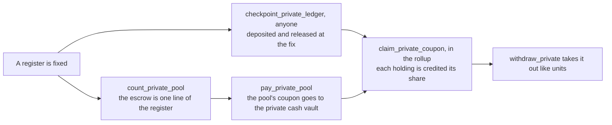
```mermaid
flowchart LR
  F["A register is fixed"] --> L["checkpoint_private_ledger, anyone<br/>deposited and released at the fix"]
  F --> P["count_private_pool<br/>the escrow is one line of the register"]
  P --> Y["pay_private_pool<br/>the pool's coupon goes to the private cash vault"]
  L --> CL["claim_private_coupon, in the rollup<br/>each holding is credited its share"]
  Y --> CL
  CL --> W["withdraw_private takes it out like units"]
```

A way out that does not need the rollup to run AssetFlow:

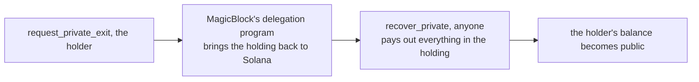
```mermaid
flowchart LR
  A["request_private_exit, the holder"] --> B["MagicBlock's delegation program<br/>brings the holding back to Solana"]
  B --> C["recover_private, anyone<br/>pays out everything in the holding"]
  C --> D["the holder's balance becomes public"]
```

## 11. The circuit breaker for trading pools

A pool's token accounts belong to its authority, which is no investor, so the gate never thaws them. Compliance can
approve one pool account as a venue. The venue record sits at the pool authority's investor address, where the gate
already looks, so no account list changes. The gate thaws that account only while the venue is open, and anyone may
freeze it otherwise. A frozen pool account can neither send nor receive, so every swap against the pool fails before it
trades. Wallet-to-wallet transfers are never touched.

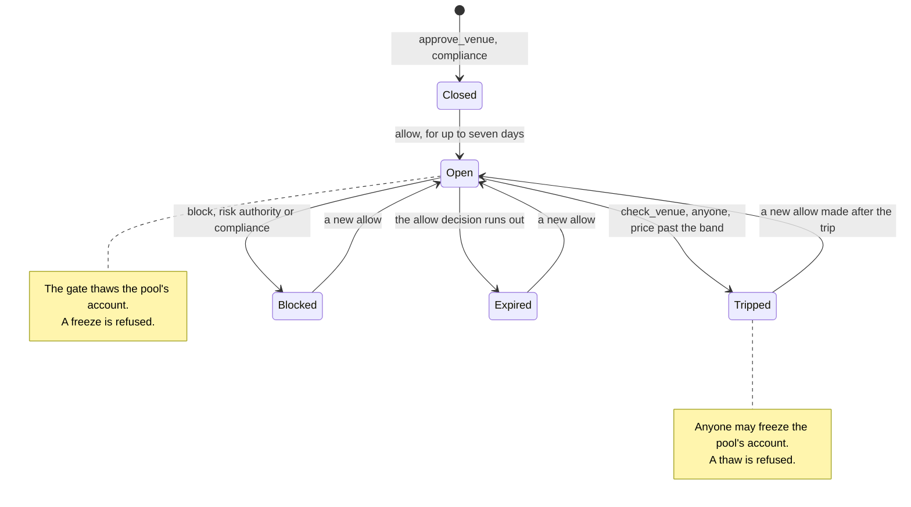
```mermaid
stateDiagram-v2
  [*] --> Closed: approve_venue, compliance
  Closed --> Open: allow, for up to seven days
  Open --> Tripped: check_venue, anyone, price past the band
  Open --> Blocked: block, risk authority or compliance
  Open --> Expired: the allow decision runs out
  Tripped --> Open: a new allow made after the trip
  Blocked --> Open: a new allow
  Expired --> Open: a new allow
  note right of Open
    The gate thaws the pool's account.
    A freeze is refused.
  end note
  note right of Tripped
    Anyone may freeze the pool's account.
    A thaw is refused.
  end note
```

The price check needs no oracle. The program already prices the bond: face plus accrued interest, what an early
redemption pays.

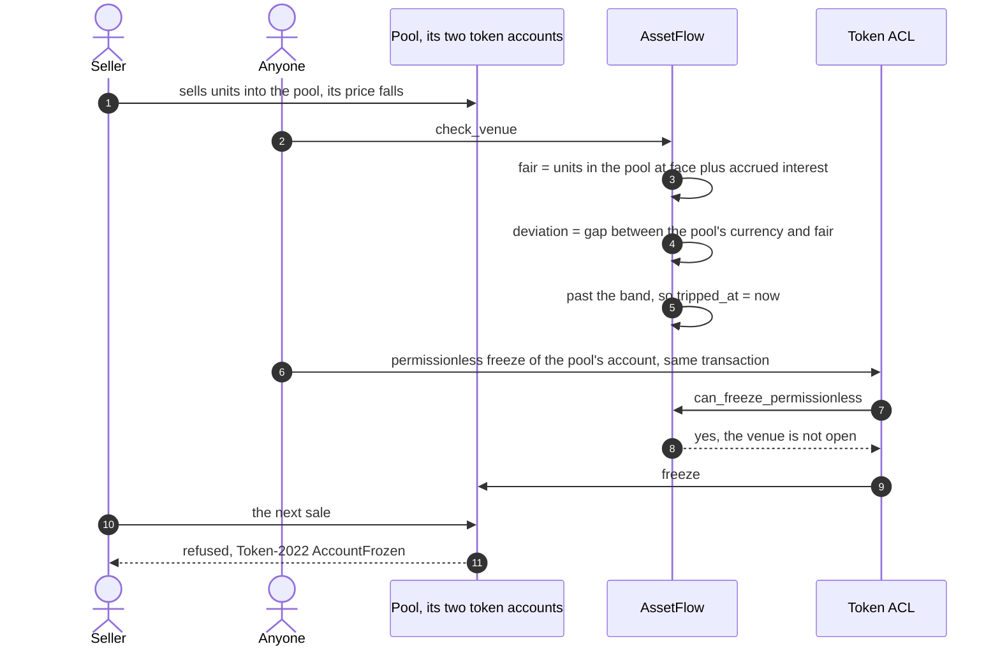
```mermaid
sequenceDiagram
  autonumber
  actor S as Seller
  actor X as Anyone
  participant P as Pool, its two token accounts
  participant AF as AssetFlow
  participant ACL as Token ACL

  S->>P: sells units into the pool, its price falls
  X->>AF: check_venue
  AF->>AF: fair = units in the pool at face plus accrued interest
  AF->>AF: deviation = gap between the pool's currency and fair
  AF->>AF: past the band, so tripped_at = now
  X->>ACL: permissionless freeze of the pool's account, same transaction
  ACL->>AF: can_freeze_permissionless
  AF-->>ACL: yes, the venue is not open
  ACL->>P: freeze
  S->>P: the next sale
  P-->>S: refused, Token-2022 AccountFrozen
```

## 12. The EVM contracts

The same servicing in Solidity (Foundry, OpenZeppelin 5). The token checks the registry on every transfer and keeps
balances as checkpoints, so the register at any record date is read from the chain, with no pause and no commitment.

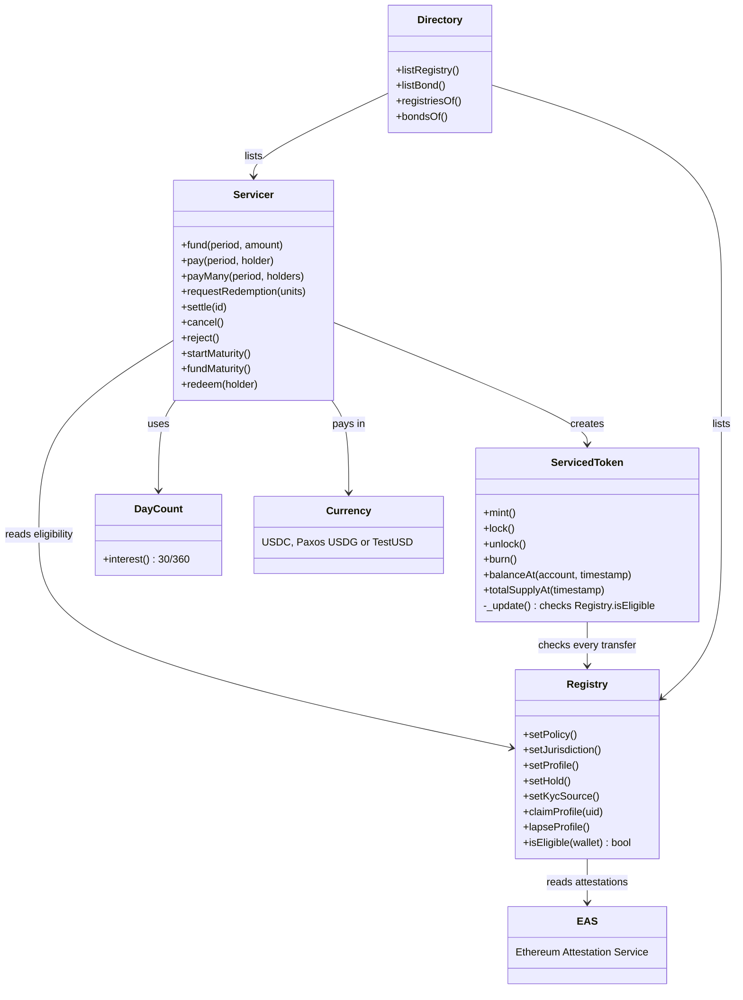
```mermaid
classDiagram
  class Registry {
    +setPolicy()
    +setJurisdiction()
    +setProfile()
    +setHold()
    +setKycSource()
    +claimProfile(uid)
    +lapseProfile()
    +isEligible(wallet) bool
  }
  class ServicedToken {
    +mint()
    +lock()
    +unlock()
    +burn()
    +balanceAt(account, timestamp)
    +totalSupplyAt(timestamp)
    -_update() checks Registry.isEligible
  }
  class Servicer {
    +fund(period, amount)
    +pay(period, holder)
    +payMany(period, holders)
    +requestRedemption(units)
    +settle(id)
    +cancel()
    +reject()
    +startMaturity()
    +fundMaturity()
    +redeem(holder)
  }
  class Directory {
    +listRegistry()
    +listBond()
    +registriesOf()
    +bondsOf()
  }
  class DayCount {
    +interest() 30/360
  }
  class EAS {
    Ethereum Attestation Service
  }
  class Currency {
    USDC, Paxos USDG or TestUSD
  }
  Servicer --> ServicedToken : creates
  Servicer --> Registry : reads eligibility
  ServicedToken --> Registry : checks every transfer
  Registry --> EAS : reads attestations
  Servicer --> Currency : pays in
  Servicer --> DayCount : uses
  Directory --> Registry : lists
  Directory --> Servicer : lists
```

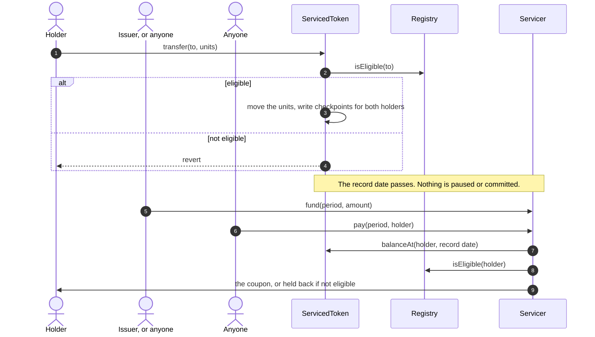
```mermaid
sequenceDiagram
  autonumber
  actor A as Holder
  actor I as Issuer, or anyone
  actor X as Anyone
  participant T as ServicedToken
  participant R as Registry
  participant S as Servicer

  A->>T: transfer(to, units)
  T->>R: isEligible(to)
  alt eligible
    T->>T: move the units, write checkpoints for both holders
  else not eligible
    T-->>A: revert
  end
  Note over T,S: The record date passes. Nothing is paused or committed.
  I->>S: fund(period, amount)
  X->>S: pay(period, holder)
  S->>T: balanceAt(holder, record date)
  S->>R: isEligible(holder)
  S->>A: the coupon, or held back if not eligible
```

## 13. The app

One Next.js app. The Solana pages reach devnet through a server-side RPC proxy, so the RPC key never reaches the
browser. The EVM pages are the same pages for every chain, picked by the URL. The keys that sign for the demo KYC
providers live only in server environment variables.

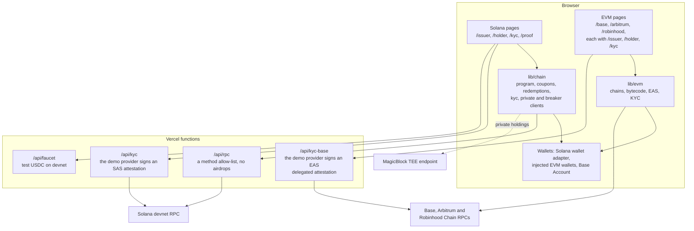
```mermaid
flowchart TB
  subgraph Browser
    SP["Solana pages<br/>/issuer, /holder, /kyc, /proof"]
    EP["EVM pages<br/>/base, /arbitrum, /robinhood,<br/>each with /issuer, /holder, /kyc"]
    LC["lib/chain<br/>program, coupons, redemptions,<br/>kyc, private and breaker clients"]
    LE["lib/evm<br/>chains, bytecode, EAS, KYC"]
    WA["Wallets: Solana wallet adapter,<br/>injected EVM wallets, Base Account"]
  end

  subgraph Server["Vercel functions"]
    RPC["/api/rpc<br/>a method allow-list, no airdrops"]
    KYC["/api/kyc<br/>the demo provider signs an SAS attestation"]
    KYB["/api/kyc-base<br/>the demo provider signs an EAS<br/>delegated attestation"]
    FAU["/api/faucet<br/>test USDC on devnet"]
  end

  SP --> LC
  EP --> LE
  LC --> WA
  LE --> WA
  LC --> RPC
  SP --> KYC
  SP --> FAU
  EP --> KYB
  RPC --> DEV["Solana devnet RPC"]
  KYC --> DEV
  LE --> CH["Base, Arbitrum and<br/>Robinhood Chain RPCs"]
  KYB --> CH
  LC -.->|private holdings| TEE["MagicBlock TEE endpoint"]
```

## 14. Deployments

Every address is in the README and in [evm/deployments](evm/deployments).

```mermaid
flowchart LR
  GL["GitLab main"] -->|every push deploys| VC["Vercel:<br/>assetflow-servicing.vercel.app"]
  GH["GitHub mirror"]

  subgraph SolanaDev["Solana devnet"]
    PRG["AssetFlow program<br/>BWDCF6dL...tjwR"]
    TEEV["MagicBlock TEE validator"]
  end

  subgraph Main["Mainnets"]
    BM["Base: a pilot note on USDC"]
    AM["Arbitrum One: a pilot note on USDC"]
    HK["HashKey Chain: the first version"]
  end

  subgraph Test["EVM testnets with full consoles"]
    BS["Base Sepolia"]
    ASP["Arbitrum Sepolia: bonds in USDG"]
    RH["Robinhood Chain testnet: bonds in USDG,<br/>EAS deployed by AssetFlow"]
  end

  VC --> SolanaDev
  VC --> Test
  VC --> Main
```

## 15. Who can do what

```mermaid
flowchart LR
  ADM["Registry admin"] --> a1["create the registry, name compliance,<br/>co-sign each asset's registration"]
  COM["Compliance"] --> c1["policy and profiles, the KYC source,<br/>force freezes, private holds,<br/>approve, block and close venues"]
  ISS["Issuer"] --> i1["issue to eligible holders, set terms,<br/>settle or reject redemptions,<br/>enable private holdings"]
  RSK["Risk authority"] --> r1["allow or block its venue"]
  HLD["Holder"] --> h1["thaw their own account, claim a profile,<br/>request or cancel a redemption,<br/>deposit, transfer and withdraw privately"]
  ANY["Anyone"] --> y1["freeze an ineligible holder,<br/>fix, count and close registers,<br/>fund and pay coupons, start and fund maturity,<br/>redeem holdings, lapse profiles,<br/>check and freeze venues, release private exits"]
```

## 16. What you trust

- **The program and its upgrade authority.** The devnet program is upgradeable by its deployer, and nothing here is
  audited yet.
- **Token ACL, Token-2022 and the Solana Attestation Service,** the Solana Foundation's programs, loaded unmodified in
  the tests.
- **The KYC provider a registry trusts.** Its attestations write profiles. Compliance can stop trusting it at any time,
  and an attestation never lifts a compliance hold.
- **MagicBlock's TEE validator and its operator,** for private holdings. The issuer, compliance and the named auditor
  can read every private balance. If the validator's state were lost for good, balances it never committed could not be
  recovered on-chain.
- **Someone running the checks.** The gate decides when asked; it does not act alone. A lapsed approval or a tripped
  pool stays thawed until anyone sends the freeze. A transfer hook would refuse the next transfer by itself; this design
  keeps every wallet and program working with the asset instead.
- **On EVM chains:** the contracts in `evm/src`, the attester a registry names on the Ethereum Attestation Service, and
  the payment currency's issuer. See [evm/SECURITY.md](evm/SECURITY.md).
